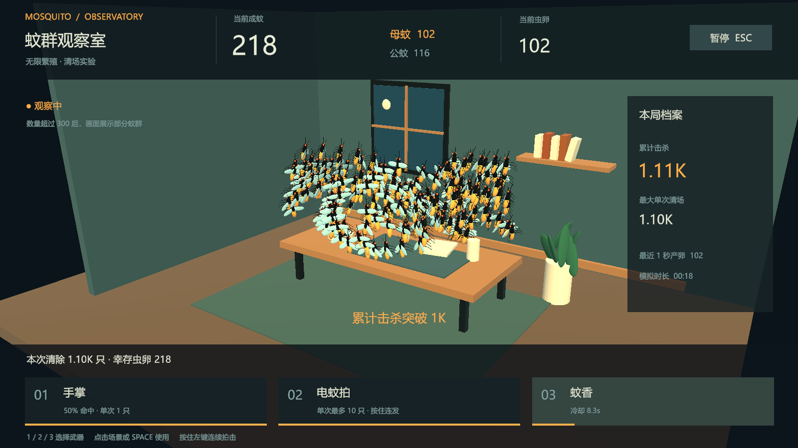

# 蚊群观察室 · Mosquito Observatory

从四只蚊子开始的 PC 单机沙盒原型。观察繁殖，解锁手掌、电蚊拍和蚊香，清掉成蚊，再看幸存虫卵回弹。

当前开发基于 [GDD v1.1](./蚊子游戏模拟器_游戏策划文档_GDD_v1.1_PC_Unity_Blender.md)。这是正在开发的原型，不代表 GDD 全部美术、性能和试玩目标已经验收。



## 工具版本

| 工具 | 已锁定版本 |
|---|---|
| Unity | 6000.3.23f1 / Unity 6.3 LTS |
| Universal RP | 17.3.0 |
| Input System | 1.20.0 |
| Unity Test Framework | 1.6.0 |
| uGUI / TextMeshPro | 2.0.0 包内资源 |
| Blender | 5.2.1 LTS |
| 构建目标 | Windows x64 / Mono / Direct3D 11 |

## 打开与运行

将**此仓库根目录**作为项目添加到 Unity Hub，使用上述编辑器版本打开。

1. 打开 `Assets/Game/Scenes/Observatory.unity`。
2. 点击 Play，在主菜单选择“开始观察”。
3. 若是首次恢复工程或场景尚未生成，执行菜单 **Mosquito → Set up prototype**。

本地构建后的程序位于 `Builds/Windows/MosquitoObservatory.exe`。整个 `Builds/Windows` 文件夹一起复制才能运行，不能只复制 exe。构建产物和 Unity 缓存不提交 Git。

发给其他电脑时，运行 `.\Tools\Package.ps1`，发送生成在 `Builds/Releases` 中的完整 ZIP。接收方先右键“全部解压缩”，再运行文件夹里的 exe，无需安装 Unity 或 Blender。打包脚本包含 `UnityPlayer.dll`、游戏数据和 Mono 运行库，并排除开发调试目录。如果提示缺少 `UnityPlayer.dll`，先检查是否只复制了 exe 或没有完整解压。

## 操作

| 输入 | 动作 |
|---|---|
| 1 / 2 / 3，或武器卡片 | 选择已解锁武器 |
| 点击场景 / Space | 使用选定武器；攻击为全局随机，不需要瞄准 |
| 按住场景中的鼠标左键 | 手掌、电拍按冷却重复攻击 |
| Esc / 暂停按钮 | 暂停；从菜单继续 |
| Alt-Tab / 最小化 | 自动暂停，回来后主动继续 |

母蚊和虫卵均为零时结束繁殖，可以重开。退出后支持继续当前局，但不会获得离线增长。正常游戏存档位于 Unity 的 `Application.persistentDataPath`，保留一份备份；测试和截图使用单独存档目录。

## 命令行工作流

在仓库根目录运行 PowerShell：

```powershell
.\Tools\Unity.ps1 -Action Setup
.\Tools\Unity.ps1 -Action Test
.\Tools\Unity.ps1 -Action Build
```

脚本优先使用 `UNITY_EDITOR_PATH`，其次查找 Unity Hub 默认安装目录与本机 `D:\untyle`。其他安装位置可显式指定：

```powershell
.\Tools\Unity.ps1 -Action Test -EditorPath 'C:\Path\To\Editor\Unity.exe'
```

测试结果为 `TestResults/editmode.xml`，构建摘要为 `TestResults/build-summary.txt`，运行日志在 `Logs`。可重复的核心测试涵盖繁殖时序、击杀与产卵顺序、随机恢复、大数精度、格式化和存档备份。

构建后可运行 `.\Tools\Capture.ps1 -SmokeTest` 验证自然解锁、三种武器、暂停和存读档，并输出实际游戏截图；`.\Tools\Capture.ps1 -Menu` 输出主菜单截图。验证使用独立存档目录，声音静音，完成后自动退出。

## 项目结构

- `Assets/Game/Scripts/Core`：不依赖 UnityEngine 的确定性 C# 模拟。
- `Assets/Game/Scripts/Runtime`：固定 Tick 驱动、UI、实例渲染、程序音效和存档。
- `Assets/Game/Editor`：工程初始化与 Windows 构建入口。
- `Assets/Game/Tests/EditMode`：规则与存档测试。
- `Assets/Game/Resources/Models`：Blender 导出的蚊子 FBX。
- `SourceArt/Blender`：可编辑 `.blend` 源文件与资产说明。
- `Tools/create_mosquito.py`：可重复的 Blender 模型生成与导出脚本。
- `Docs/DevelopmentStatus.md`：阶段进度、验证证据和未完成项。

文字运行时使用 Windows 已安装的微软雅黑字体，回退到 Arial；仓库不复制 Windows 字体文件。TextMeshPro 的基础资源由已安装的 Unity 包导入。
